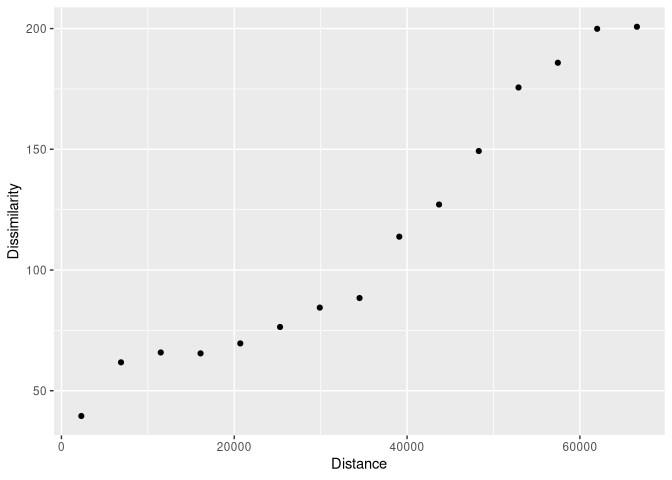

<!-- README.md is generated from README.Rmd. Please edit that file -->

# patternogram

<!-- badges: start -->

[](https://lifecycle.r-lib.org/articles/stages.html#experimental)
[](https://app.codecov.io/gh/Nowosad/patternogram?branch=main)
[](https://github.com/Nowosad/patternogram/actions/workflows/R-CMD-check.yaml)
<!-- badges: end -->

The goal of **patternogram** is to quantify the spatial autocorrelation
of values from a set of points or a raster object. It does this by
calculating the dissimilarity between pairs of points at different
distances, and then grouping these dissimilarity estimates into distance
intervals to create a patternogram. The patternogram can be used to
identify the spatial scale at which the pattern of the points or raster
changes and to compare the patterns of different sets of points or
rasters.

## Installation

You can install the development version of patternogram from
[GitHub](https://github.com/) with:

``` r
# install.packages("devtools")
devtools::install_github("Nowosad/patternogram")
```

## Example

``` r
library(patternogram)
library(terra)
#> terra 1.7.29
r = rast(system.file("ex/elev.tif", package = "terra"))
pr = patternogram(r)
pr
#> # A tibble: 15 × 3
#>       np  dist dissimilarity
#>  * <int> <dbl>         <dbl>
#>  1   106  2300          39.5
#>  2   288  6895          61.8
#>  3   451 11495          65.8
#>  4   535 16100          65.5
#>  5   583 20700          69.6
#>  6   527 25300          76.4
#>  7   521 29900          84.4
#>  8   477 34500          88.4
#>  9   391 39100         114. 
#> 10   321 43700         127. 
#> 11   261 48300         149. 
#> 12   178 52900         176. 
#> 13   124 57450         186. 
#> 14    94 62000         200. 
#> 15    57 66600         201.
plot(pr)
```



## Contibution

Contributions to this package are welcome - let us know if you have any
suggestions or spotted a bug. The preferred method of contribution is
through a GitHub pull request. Feel also free to contact us by creating
[an issue](https://github.com/Nowosad/patternogram/issues).
