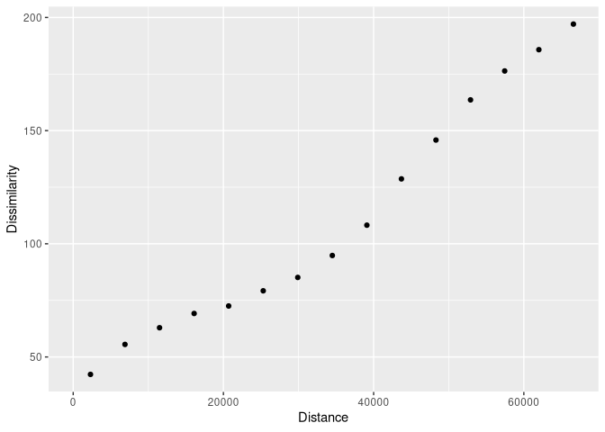

<!-- README.md is generated from README.Rmd. Please edit that file -->

# patternogram

<!-- badges: start -->

[](https://lifecycle.r-lib.org/articles/stages.html#experimental)
[](https://app.codecov.io/gh/Nowosad/patternogram?branch=main)
[](https://github.com/Nowosad/patternogram/actions/workflows/R-CMD-check.yaml)
<!-- badges: end -->

The goal of **patternogram** is to quantify the spatial autocorrelation
of values from a set of points or a raster object. It does this by
calculating the dissimilarity between pairs of points at different
distances, and then grouping these dissimilarity estimates into distance
intervals to create a patternogram. The patternogram can be used to
identify the spatial scale at which the pattern of the points or raster
changes and to compare the patterns of different sets of points or
rasters.

## Installation

You can install the development version of patternogram from
[GitHub](https://github.com/) with:

``` r
# install.packages("devtools")
devtools::install_github("Nowosad/patternogram")
```

## Example

``` r
library(patternogram)
library(terra)
#> terra 1.7.29
r = rast(system.file("ex/elev.tif", package = "terra"))
plot(r)
```


``` r
pr = patternogram(r)
pr
#> # A tibble: 15 × 3
#>       np  dist dissimilarity
#>  * <int> <dbl>         <dbl>
#>  1   106  2300          36.9
#>  2   299  6895          52.4
#>  3   509 11495          59.9
#>  4   562 16100          67.9
#>  5   587 20700          70.4
#>  6   608 25300          73.6
#>  7   522 29900          78.2
#>  8   496 34500          84.5
#>  9   389 39100         106. 
#> 10   303 43700         123. 
#> 11   243 48300         149. 
#> 12   143 52900         169. 
#> 13   101 57450         181. 
#> 14    50 62000         199. 
#> 15    15 66600         208.
plot(pr)
```



## Contibution

Contributions to this package are welcome - let us know if you have any
suggestions or spotted a bug. The preferred method of contribution is
through a GitHub pull request. Feel also free to contact us by creating
[an issue](https://github.com/Nowosad/patternogram/issues).
