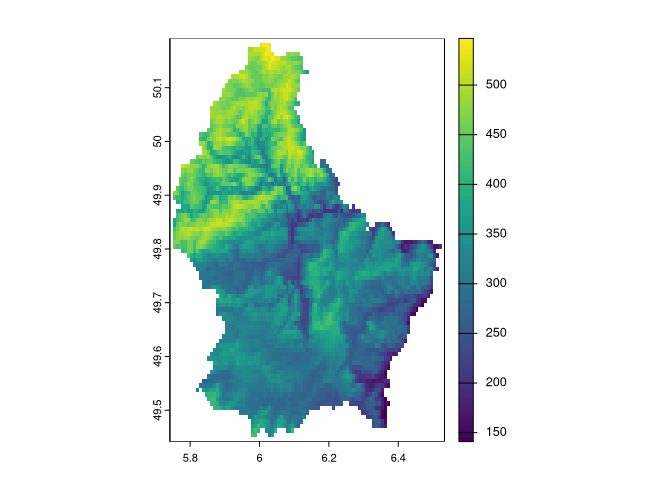

<!-- README.md is generated from README.Rmd. Please edit that file -->

# patternogram

<!-- badges: start -->

[](https://lifecycle.r-lib.org/articles/stages.html#experimental)
[](https://app.codecov.io/gh/Nowosad/patternogram?branch=main)
[](https://github.com/Nowosad/patternogram/actions/workflows/R-CMD-check.yaml)
<!-- badges: end -->

The goal of **patternogram** is to quantify the spatial autocorrelation
of values from a set of points or a raster object. It does this by
calculating the dissimilarity between pairs of points at different
distances, and then grouping these dissimilarity estimates into distance
intervals to create a patternogram. The patternogram can be used to
identify the spatial scale at which the pattern of the points or raster
changes and to compare the patterns of different sets of points or
rasters.

## Installation

You can install the development version of patternogram from
[GitHub](https://github.com/) with:

``` r
# install.packages("devtools")
devtools::install_github("Nowosad/patternogram")
```

## Example

``` r
library(patternogram)
library(terra)
#> terra 1.7.44
r = rast(system.file("ex/elev.tif", package = "terra"))
plot(r)
```



``` r
pr = patternogram(r)
pr
#> # A tibble: 15 × 3
#>       np  dist dissimilarity
#>  * <int> <dbl>         <dbl>
#>  1   105  2300          37.6
#>  2   328  6895          54.0
#>  3   474 11495          60.7
#>  4   552 16100          66.5
#>  5   583 20700          81.4
#>  6   568 25300          76.8
#>  7   526 29900          82.7
#>  8   490 34500          95.2
#>  9   405 39100         107. 
#> 10   326 43700         126. 
#> 11   234 48300         141. 
#> 12   172 52900         152. 
#> 13    81 57450         160. 
#> 14    57 62000         164. 
#> 15    28 66600         180.
plot(pr)
```


## Documentation

Take a look at a conference presentation:

1.  Exploring spatial autocorrelation and variable importance in machine
    learning models using patternograms, 2023-09-06, European Conference
    of Ecological Modelling 2023, Leipzig -
    [slides](https://jakubnowosad.com/ecem-2023)

## Contibution

Contributions to this package are welcome - let us know if you have any
suggestions or spotted a bug. The preferred method of contribution is
through a GitHub pull request. Feel also free to contact us by creating
[an issue](https://github.com/Nowosad/patternogram/issues).
